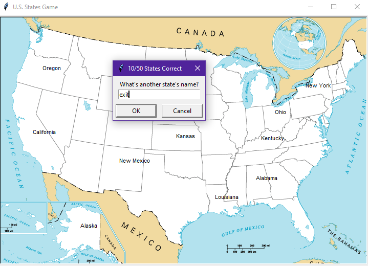

# Jogo de Adivinhação - Estados dos E.U.A.
O objetivo do jogo consiste em adivinhar todos os 50 Estados do território norte-americano.

**JOGO EM FUNCIONAMENTO:**

Para sair do jogo, basta digitar "Exit". Assim, o jogo gerará um arquivo .csv contendo os Estados que o jogador não digitou.

---
**Desenvolvido por:** Anderson Luis

**GitHub:** https://github.com/andluis35

**Linkedin:** www.linkedin.com/in/anderson-luis-663970325

## Módulos Utilizados
* Pandas
* Turtle
